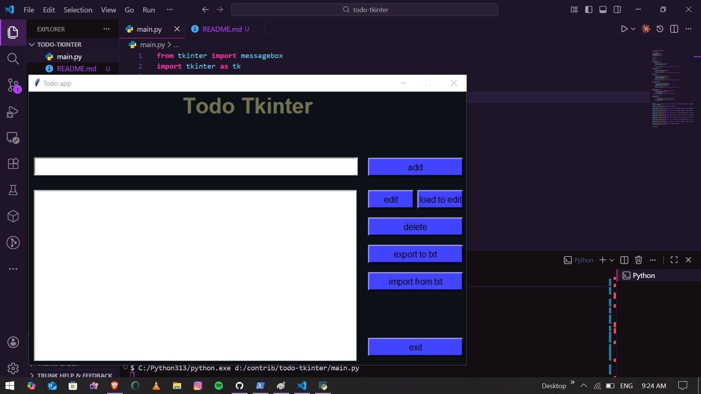

C:/Python313/python.exe d:/contrib/todo-tkinter/main.py
C:/Python313/python.exe d:/contrib/todo-tkinter/main.py
hon Tkinter\*\*.
This project is perfect for beginners who want to practice GUI development, event handling, and file operations in Python.

---

## 🚀 Features

- ✅ Add new tasks
- ✏️ Edit existing tasks
- 🔄 Load a task into the input field for editing
- ❌ Delete selected tasks
- 📤 Export all tasks to a `.txt` file
- 📥 Import tasks from a `.txt` file
- 💾 Automatically load imported tasks into the interface
- 🎨 Clean Tkinter interface with custom colors
- 🖥️ Fully offline application

---

## 🖼️ App Preview

> 

---

## 📦 Installation

Make sure you have **Python 3.x** installed.

Clone the repository:

```bash
git clone https://github.com/salomon-tech/todo-tkinter.git
cd todo-tkinter
```

Run the application:

```bash
python main.py
```

---

## 🧩 How It Works

### 1. Add a Task

Type your task into the input field and click **Add**.

### 2. Edit a Task

- Select a task in the Listbox
- Click **Load to Edit**
- Modify the text
- Click **Edit** to update it

### 3. Delete a Task

Select a task and click **Delete**.

### 4. Export Tasks

Click **Export to TXT** to save all tasks in `task.txt`.

### 5. Import Tasks

Click **Import From TXT** to load saved tasks back into the app.

---

## 📁 Project Structure

```
todo-tkinter/
│── main.py         # The main application file
│── task.txt        # (Created automatically after export)
│── README.md       # Project documentation
```

---

## 🛠️ Technologies Used

- **Python**
- **Tkinter** (Standard Library GUI)
- **messagebox** UI alerts
- **File handling (txt export/import)**

---

## 🤝 Contributing

Contributions are welcome!
If you want to improve the UI, add new features, or restructure the code, feel free to submit a pull request.

---

## 📄 License

This project is open-source and available under the **MIT License**.

---

## ⭐ Support

If you like this project, consider giving it a **star ⭐ on GitHub** to support the developer!

---

If you want, I can also prepare:

✅ A logo for the project
✅ A cleaner UI with `ttk` or `customtkinter`
✅ A version using SQLite database

Just tell me!
